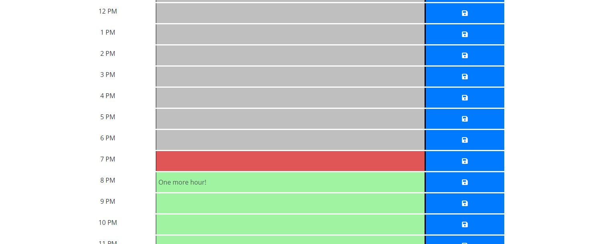

Create, adjust, and plan your day here with this simple daily planner app. 

This calendar day planner is a simple alternative to the many complicated applications out there that are used for everyday time scheduling. Simply load it in your browser and plan away. No need to keep the application open, as it will remember your schedule years from now.

# Installation 

```
git init
git remote add origin main
git branch -M main
git pull
```

## Credits

[Origin 42](https://github.com/origin-42)

[Dave Plummer](https://origin-42.github.io/Dave-Plummer-Portfolio/) - Dave Plummer Portfolio Website

[Moment](https://momentjs.com/)

[Boostrap](https://getbootstrap.com/docs/5.0/getting-started/introduction/)

[JQuery UI](https://jqueryui.com/)

## Extras

[Home Screen](https://origin-42.github.io/quiztimeout/) - DoneDaily


